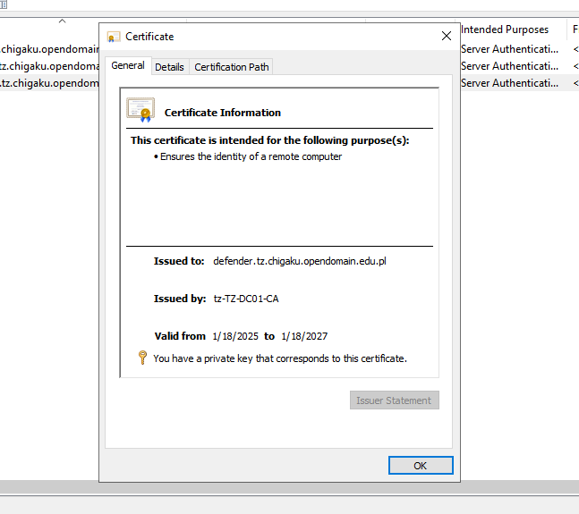

# Part 1 - Preparing environment

## Briefing about the testing domain. Administrative notes

About the domain `tz.chigaku.opendomain.edu.pl`:

> TheFlightSims is a dark-web company and an international company primarily researching and engineering in the aerospace industry. Globally, the company has offices in North America (Boston and Florida, both in the US) and Asia Pacific (Tokyo - Japan, Can Tho - Vietnam, and Singapore).
>
> In 2024, TheFlightSims and the partners have deployed a DNS named `opendomain.edu.pl`. The primary goal of the project is, providing the free and community-maintained domain, open for community open-source projects and students and researchers in developing their personal projects.
>
> With that goal and to develop the pseudo tenant on Microsoft Azure, named *Chigaku University*. It contains the production zone `chigaku.opendomain.edu.pl` and a testing zone `tz.chigaku.opendomain.edu.pl`. Unlike the production zone - which is using Entra ID (formerly known as Azure Active Directory), the testing zone uses the local deployment of Active Directory, running on Windows Server 2022.
>
> In several testing procedures, later then the sync between the two, both zones have been facing the major security issues. The administrators then look for a solution from Microsoft.
>
> They have chosen Microsoft Advanced Threat Analytics (or ATA in short) as the threat analytical tool for potential attack and virus protection for all domain controllers, functional servers, and essential computers. However, they noticed that ATA only runs on port 443. It quickly becomes serious because the chosen server runs Windows Server 2022 with IIS installed as the web server and proxy server, which is already configured with port 443.

The domain `tz.chigaku.opendomain.edu.pl` is an Active Directory Domain-configured, where the DNS Server is also running within the domain and installed on the Domain Controller. DNSSEC is not enabled on this sub-zone.

Take note of the servers and their services below. Unrelated servers and services don't count in the graphic.

 

## Administrator plans

Since the `tz-NET01` is already the web server (using 80 and 443 ports), it is good to know that the proxy server is also the tz-NET01. That means Microsoft ATA should be configured in port 8080 (or any other available port) and reserve the 443 for IIS.

After checking the ATA is running successfully in port 8080, the IIS will be used as the proxy server to control the traffic in and out for the ATA.

> IIS `tz-NET01` will be configured like this:
>
> - "Default Web Site" will respond for hostname `tz-NET01.tz.chigaku.opendomain.edu.pl`
> - "Microsoft ATA" will respond for hostname `defender.tz.chigaku.opendomain.edu.pl`
> - Configure this host name in **Blinding > {Select your type, either http or https} > Host name**. Remember to check the box "Require Server Name Indication" when available.
>
> DNS Server in `tz-DC01` will be configured like this:
>
> - Update the CNAME of `defender.tz.chigaku.opendomain.edu.pl` address to the IP address of `tz-NET01.tz.chigaku.opendomain.edu.pl`

## Preparing environment for the ATA setup

1. First of all, it is the certificate. The new DNS will be `defender.tz.chigaku.opendomain.edu.pl`. Make sure the DNS' certificate is `defender.tz.chigaku.opendomain.edu.pl`

 

Once the setup is running, select the certificate that has been configured. (In that case, the certificate corresponds to `defender.tz.chigaku.opendomain.edu.pl`)

 

1. Prevent all running IIS hosts using blinding port 443 but not deleting it. For example, "Default Web Site" by default uses port 443 - which is recommended to temporarily stop because the ATA is not yet configured.

## Next step

Once you follow and understand everything, and you are done with everything, it is a good sign to know that you are ready for the next step.
