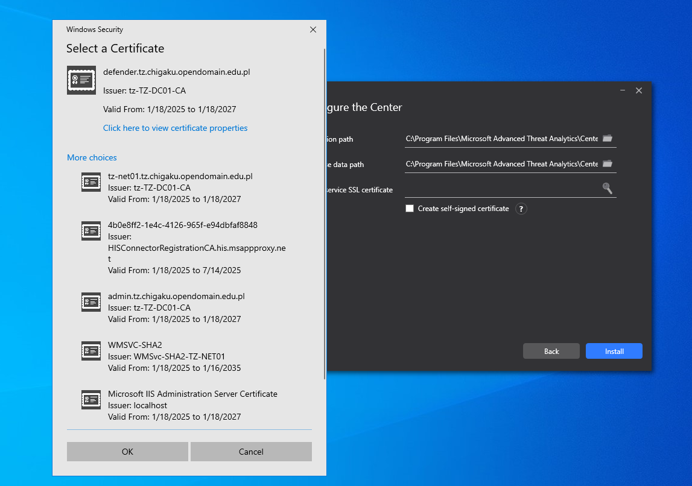

# Part 1 - Preparing environment

## Briefing about the domain and administrative notes

About the domain `testzone01.asp.theflightsims.eu.org`:

> TheFlightSims is an international company, primary researching and engineering in aerospace industry. Globally, the company has office in North America (Boston and Florida, both in the US) and Asia Pacific (Tokyo - Japan, Can Tho - Vietnam, and Singapore).
>
> In Asia Pacific zone (`asp.theflightsims.eu.org`), the regional administrators decided to open a new DNS sub zone, named "testzone01", as the zone where all the software testing proceed. One of many tests that those engineers perform is increase the level of security of the current setting, by testing which one is effective.
>
> They have chosen Microsoft Advanced Threat Analytics (or ATA in short), as the threat analytical tool for potential attack and virus protection for all domain controllers, functional servers, and essential computers. However, they noticed that ATA only run on port 443. It quickly becomes serious because the chosen server running Windows Server 2022 with IIS installed as the web server and proxy server, which is already configured port 443.

The domain `testzone01.asp.theflightsims.eu.org` is an Active Directory Domain-configured, where the DNS Server is also running within the Domain, and installed on the Domain Controller.

This domain is not enabled DNSSEC by default.

Take a note of servers and it services below. Unrelated servers and services doesn't count in the graphic.

 

## Administrator plans

Since the `zone01-NET01` is already the web server (using 80 and 443 ports), it is good to know that the proxy server is also the zone01-NET01. That means, Microsoft ATA should be configured in port 8080 (or any other ports that is available), reserve the 443 for IIS.

After checking the ATA is running successfully in port 8080, the IIS will be used as the proxy server, to control the traffic in-out for the ATA.

> IIS `zone01-NET01` will be configured like this:
>
> - "Default Web Site" will respond for host name `zone01-NET01.testzone01.asp.theflightsims.eu.org`
> - "Microsoft ATA" will respond for host name `defender.testzone01.asp.theflightsims.eu.org`
> - Configure this host name in **Blinding > {Select your type, either http or https} > Host name**. Remember check the box "Require Server Name Indication" when available.
>
> DNS Server in `zone01-DC01` will be configured like this:
>
> - Update the CNAME of `defender.testzone01.asp.theflightsims.eu.org` address to the IP address of `zone01-NET01.testzone01.asp.theflightsims.eu.org`

## Preparing environment for the ATA setup

1. First of all, it is the certificate. The new DNS will be `defender.testzone01.asp.theflightsims.eu.org`. Make sure the DNS' certificate is `defender.testzone01.asp.theflightsims.eu.org`

 

Once you run the setup, make sure you select the right certificate you have configured. (In that case, the certificate corresponds to `defender.testzone01.asp.theflightsims.eu.org`)

 

2. Stopping all running IIS hosts that use blinding for port 443, instead of actual deleting it. For example, "Default Web Site" by default use port 443, it is recommended to temporary stopping it, because the ATA is not yet to be configured.

 

## Next step

Once you follow and understand everything, and you are done by everything, it is a good sign to know that you are ready for the next step.
