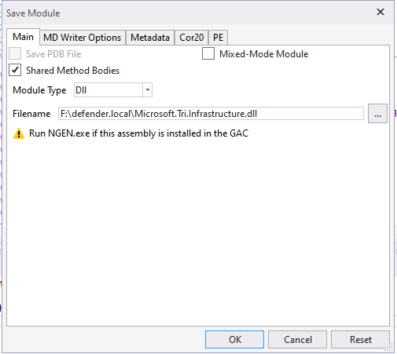

# Part 2 - Patching ATA

> This document is written by [Vo Luu Tuong Anh](https://github.com/anhvlt-2k6), a first-year student of Software Engineering at FPT University.

## Recommendations before patching

It is recommended to install [ATA 1.9 Update 3](https://learn.microsoft.com/en-us/advanced-threat-analytics/ata-update-1.9.3-migration-guide) before proceeding. All information about planning, software requirements, upgrade paths, deployments, and usages is available on [Microsoft Learn](https://learn.microsoft.com/en-us/advanced-threat-analytics/what-is-ata).

Also, please stop the "Microsoft Advanced Threat Analytics Center" service and backup **EVERYTHING** inside the "Backup" folder. By default, it is located in this path.

```cmd
C:\Program Files\Microsoft Advanced Threat Analytics\Center
```

## Finding for targets

### 1. Looking for backup files

I first thought that Microsoft ATA is written in C# of the .NET 4 family (maybe .NET 4.6.1). However, it is hard to determine which file defines port configuration, so I found out just by taking a look at the files in the "Backup" folder.
There is an exciting key in those backup files under JSON.

```json
"CenterWebApplicationConfiguration": {
    "ServiceListeningIpEndpoint": {
        "_t": "EndpointData",
        "Address": "0.0.0.0",
        "Port": 443
 },
    "CommunicationCookieExpiration": "00:20:00"
},
"CenterWebClientConfiguration": {
    "RetryDelay": "00:00:01",
    "ServiceEndpoints": [
 {
            "_t": "EndpointData",
            "Address": "zone01-NET01.testzone01.asp.theflightsims.eu.org",
            "Port": 443
 }
 ],
    "ServiceCertificateThumbprints": [
        "<value>"
 ]
},
```

Note that both `ServiceListeningIpEndpoint` and `ServiceEndpoints` are configured for port 443, but `ServiceListeningIpEndpoint` is for web configuration, and `ServiceEndpoints` is for client to connect to the host.

I have changed the port for both to "8080", then re-import into the ATA Mongo DB as configuration, where the Mongo DB locates in `C:\Program Files\Microsoft Advanced Threat Analytics\Center\MongoDB\bin`

```powershell
mongoimport.exe --db ATA --collection SystemProfile --file "<SystemProfile.json backup file>" --upsert
```

However, when I restart the service, it seems nothing is running. That leads me to another conclusion: the port configuration is either in another configuration file or is being fixed and cannot be changed by editing the existing setting file.

### 2. Reverse engineering ATA

As I look for other files, I see a notable port configuration in `CenterConfiguration.json`

```json
{
  "DatabaseConfigurationServerEndpoint": {
    "Address": "localhost",
    "Port": 27017
 }
}
```

I messed up with it a bit, waiting for it to return an error, and this happened:

```powershell
2024-10-17 15:44:13.7498 4028 5 Error [JsonTextReader] Newtonsoft.Json.JsonReaderException: Additional text encountered after finished reading JSON content: e. Path '', line 7, position 0.
 at Newtonsoft.Json.JsonTextReader.Read()
 at Newtonsoft.Json.Serialization.JsonSerializerInternalReader.Deserialize(JsonReader reader, Type objectType, Boolean checkAdditionalContent)
 at Newtonsoft.Json.JsonSerializer.DeserializeInternal(JsonReader reader, Type objectType)
 at Newtonsoft.Json.JsonConvert.DeserializeObject(String value, Type type, JsonSerializerSettings settings)
 at Newtonsoft.Json.JsonConvert.DeserializeObject[T](String value, JsonSerializerSettings settings)
 at async Microsoft.Tri.Infrastructure.Framework.ConfigurationManager`2.OnInitializeAsync[](?)
 at async Microsoft.Tri.Center.Service.CenterConfigurationManager.OnInitializeAsync(?)
 at async Microsoft.Tri.Infrastructure.Framework.Module.InitializeAsync(?)
 at async Microsoft.Tri.Infrastructure.Framework.ModuleManager.OnInitializeAsync(?)
 at async Microsoft.Tri.Infrastructure.Framework.Module.InitializeAsync(?)
 at async Microsoft.Tri.Infrastructure.Framework.Service.OnStartAsync(?)
 at Microsoft.Tri.Infrastructure.Framework.Service.OnStart(String[] args)
```

At that point, I can say that the configurations, including the web port.

Copying all `Microsoft.Tri.*` into another computer for debugging, then use dnSpy to find variables, constants, and functions that match these names:

- `port`
- `443`
- `http`
- `export`

After searching for many results, I found that `Microsoft.Tri.Infrastructure.Utils.HttpHelper` has a function call.

```cs
public static void ConfigureSslOnAllIpAddresses(X509Certificate2 certificate)
{
    Ensure.NotNull("certificate", certificate);
    HttpHelper.ConfigureSsl(new IPEndPoint[]
 {
        new IPEndPoint(IPAddress.Any, 443),
        new IPEndPoint(IPAddress.IPv6Any, 443)
 }, certificate, true);
}
```

As you can see, port 443 is a constant for configured ports. By editing the value in of OpCode of `ldc.i4` from `0x1BB` to `0x1F90`

<p align="center">
 
 <br>
 The port 443 is set as a constant of `0x1BB`
</p>

<p align="center">
 
 <br>
 The new port has been set as value `0x1F90`, representing port 8080
</p>

Once it is done, don't forget to save the patched `Microsoft.Tri.Infrastructure.dll` by selecting the whole `dll` namespace, then click `File > Save Module`.

<p align="center">
 
 <br>
 Save the patched module
</p>

## Applying patches to the Microsoft ATA installation

Before applying to ATA, make sure you have

1. Stopped Microsoft ATA service
2. Backup both the configuration files in a folder of "Backup" and `Microsoft.Tri.Infrastructure.dll` (rename it or copy it into a safe place)
3. (Optional, but recommended) Delete all `*.log` files to prevent logging mess up, in case you want to figure out which part of patching you haven't done yet

Once it is done, you are good to go!

### 1. Copying the patched `Microsoft.Tri.Infrastructure.dll` into the ATA folder

> Note: Make sure you paste the new module correctly into the folder `C:\Program Files\Microsoft Advanced Threat Analytics\Center`

### 2. Edit and reapply the new configuration file

Copy the latest and best configuration into another folder, then use JSON Formatter (https://jsonformatter.org/ for recommendation) to make the live editing easier.

After that, look up `ServiceListeningIpEndpoint` and `ServiceEndpoints` and edit the port to 8080.

<p align="center">
 
 <br>
 Edit to port 8080 of the JSON file
</p>

> Note:
>
> If you search for port 443 and replace everything words that match then replace it, please exclude `ServiceEndpoints` as the value `Address` of `ti.ata.azure.com` because this is the proxy service and doesn't relate to the usage of local ports.
>
> 

Once the configuration is completed, it is ready to be imported into the ATA, following this procedure:
1. Go to `C:\Program Files\Microsoft Advanced Threat Analytics\Center\MongoDB\bin` and open up the new Powershell process inside this path
2. Run this command

```powershell
.\mongo.exe ATA
```

3. In the Powershell command line interface, run this command to remove the current system profile and exit

```mongo
db.SystemProfile.remove({})
exit
```

4. In the same Powershell process, run this command to apply the new configuration

```powershell
.\mongoimport.exe --db ATA --collection SystemProfile --file "<SystemProfile.json backup file>" --upsert
```

Replace `<SystemProfile.json backup file>` with the full path address to your new configuration in JSON.

## Verify the connection to Microsoft ATA

Once everything is completed, use a browser to connect to the ATA with the port configured earlier.

<p align="center">
 
 <br>
 Port 8080 is in use of ATA
</p>
